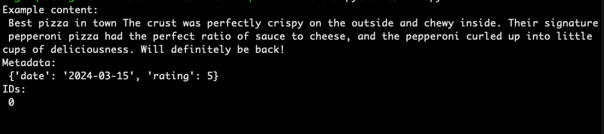
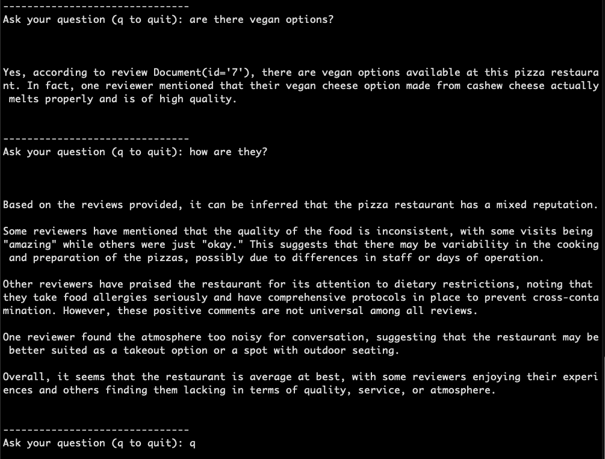

# LLM-Pizza-Reviews
##### Simple RAG (Retrieval-Augmented Generation) pipeline that uses a local LLM and vector database to answer user questions about pizza restaurant reviews based on a provided CSV file.

This project demos how to build an LLM-powered Q&A system using:

- **Ollama** to run the LLaMA 3 model locally
- **LangChain** to structure prompts and connect components
- **Chroma** (a vector database) to store and retrieve restaurant reviews based on semantic similarity

---

## How It Works

1. **Data Ingestion (`vector.py`)**
   - Loads realistic restaurant reviews from a CSV file.
   - Each review is turned into a `Document` with text content, metadata (e.g., rating, date), and a unique ID.
   - Each document is embedded into a vector using `mxbai-embed-large` via Ollama.
   - The documents and embeddings are stored in a local Chroma vector database.

2. **Querying (`main.py`)**
   - The user enters a question (e.g., *"What do people think about the crust?"*).
   - The system retrieves the top 5 semantically similar reviews from Chroma.
   - The question and relevant reviews are sent to LLaMA 3 via LangChain.
   - The model answers using context from the actual reviews.

---

## To run the app:
- pip install -r requirements.txt
- python vector.py    # (Run once to build the vector DB)
- python main.py      # (Start asking questions)

## What is a Vector Database?

A **vector database** stores high-dimensional vectors (embeddings) instead of traditional rows and columns.

Each piece of text (like a review) is converted into a numeric representation — a **vector** — using an embedding model. These vectors capture **semantic meaning**, so similar meanings are closer together in vector space.

### Example:

| Document ID | Review Text                              | Embedding (simplified)                 |
|-------------|-------------------------------------------|----------------------------------------|
| 1           | "The crust was crispy and delicious."     | `[0.14, -0.08, 0.91, ...]`             |
| 2           | "Great service and fast delivery."        | `[0.02, 0.66, -0.51, ...]`             |
| 3           | "The pizza was too salty and soggy."      | `[0.45, -0.12, 0.75, ...]`             |

When a user asks:

> “How was the pizza?”

That question is also embedded into a vector like:

[0.11, -0.02, 0.79, ..., 0.09]

The vector DB compares this vector to all the stored review vectors by similarity.

The reviews with closest vectors (i.e. most similar meaning) are returned.
---

## Vector DB vs SQL / NoSQL

| Feature                | Vector DB (e.g., Chroma)                      | SQL / NoSQL                         |
|------------------------|-----------------------------------------------|-------------------------------------|
| **Query type**         | Semantic similarity (e.g., "meaning of text") | Exact match or pattern search       |
| **Data stored**        | High-dimensional vectors + metadata           | Structured rows / key-value docs    |
| **Best for**           | Unstructured data: text, images, audio        | Structured/relational or JSON-like  |
| **Search flexibility** | Can find similar ideas/meanings               | Requires precise schema/keywords    |

---

## Examples: 

### Retrieving values from the vector DB:

### Asking questions:
