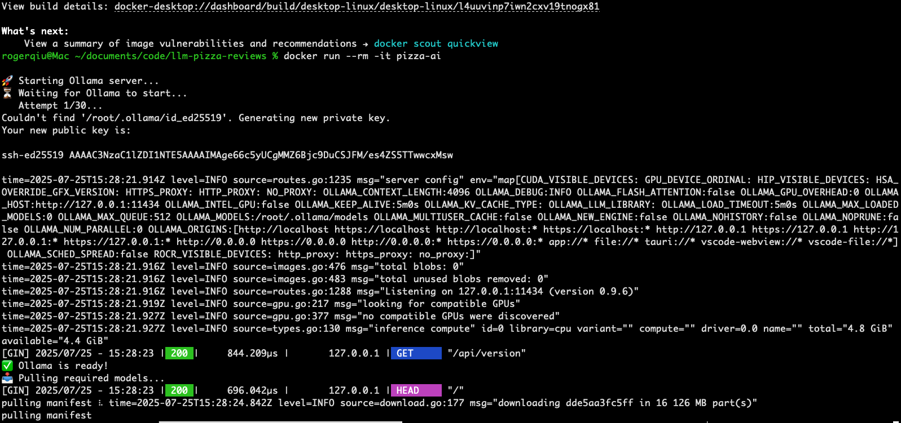
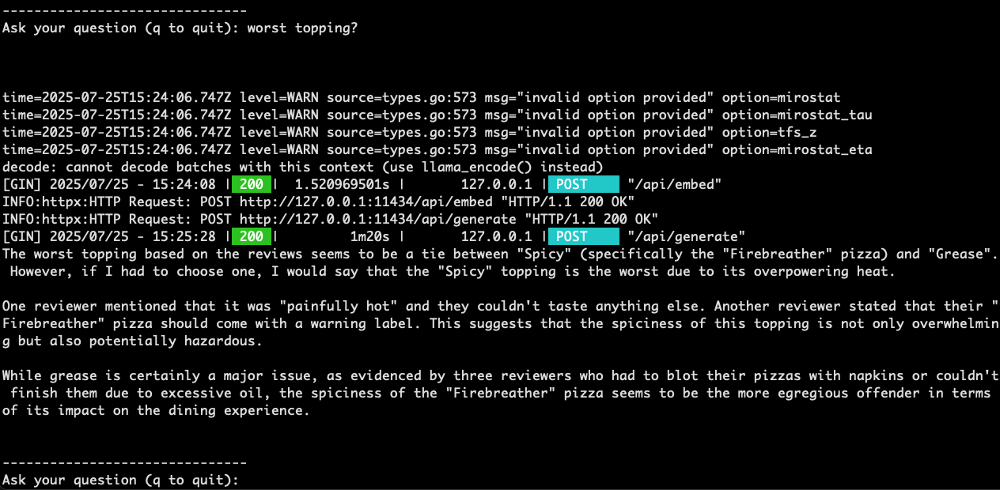

# LLM-Pizza-Reviews
A containerized RAG (Retrieval-Augmented Generation) app that uses a local LLM and vector database to answer questions about pizza restaurant reviews.

Tools used:

- **Ollama** to run models like LLaMA 3.2 locally
- **LangChain** to structure prompts and manage model input/output
- **Chroma** as a vector database for semantic retrieval
- **Docker** for portable, reproducible setup

---


## Project Structure

```
project/
├── app.py               # Main app: prompts user and returns answers
├── vector_store.py      # Loads reviews and builds semantic index
├── config.py            # Ollama base URL, model names, DB path
├── eval.py              # Test questions to validate model answers
├── entrypoint.sh        # Starts Ollama and launches the app
├── Dockerfile           # Container definition
├── requirements.txt     # Python dependencies
├── .dockerignore        # Ignore DB logs and cache files
├── data/
│   └── realistic_restaurant_reviews.csv
├── chrome_langchain_db/ # Vector DB (created at runtime)
└── rag_log.txt          # Conversation log (created at runtime)
```

## How the app works


### 1. **Review Indexing (`vector_store.py`)**
- Loads CSV reviews into memory
- Uses Ollama’s embedding model (`mxbai-embed-large`) to convert reviews to vectors
- Stores them in a local Chroma vector DB for fast semantic search

### 2. **Interactive Q&A (`app.py`)**
- User enters a question (e.g. _“What do people think about delivery?”_)
- App finds the top 5 similar reviews using vector search
- The question and reviews are passed to the LLM via LangChain
- The LLM returns a relevant answer using review context
- All questions and responses are logged to `rag_log.txt`

### 3. **Evaluation (`eval.py`)**
- Contains predefined questions and expected keywords
- Runs through each question and checks if answers contain relevant content
- Useful for verifying model performance or changes over time

---

## To run the app:
**1. Build the container:**
```bash
docker build -t pizza-ai .
```

**2. Run the container interactively:**
```bash
docker run --rm -it pizza-ai
```
---
## What Happens When You Run It

1. **The container starts and runs `/app/entrypoint.sh`:**
   - Launches the Ollama server in the background on port `11434`
   - Waits for Ollama to become ready (via HTTP check)
   - Pulls the LLM model and embedding model if not already cached
   - Starts the app (`python app.py`)

2. **Your app sends requests to Ollama inside the same container:**
   - Ollama listens on `localhost:11434`
   - Your Python code sends embed and generate requests via that port
   - No external network connection is needed — everything is self-contained

---

## What is a Vector Database?

Instead of storing data as rows and columns, a vector DB stores **semantic representations** of text — i.e. numeric vectors.

Example:
| Review Text                         | Vector (simplified)         |
|------------------------------------|-----------------------------|
| “Crust was crispy and delicious.”  | `[0.11, -0.03, 0.82, ...]`  |

When you ask a question like “How’s the crust?”, your query is converted into a vector and compared to all reviews using vector similarity.
---

## Examples: 

### Retrieving values from the vector DB:


### Running the Docker image:


### Example of question and answer:
