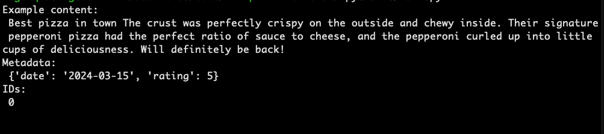
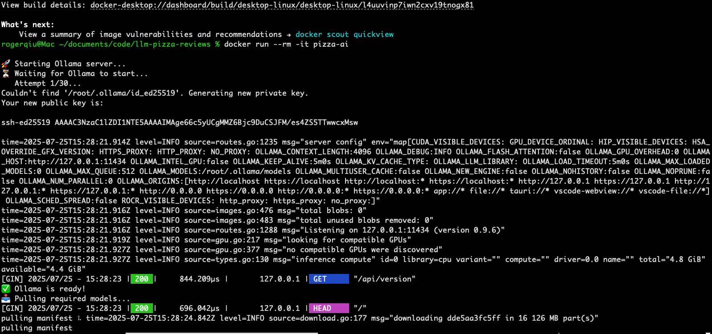
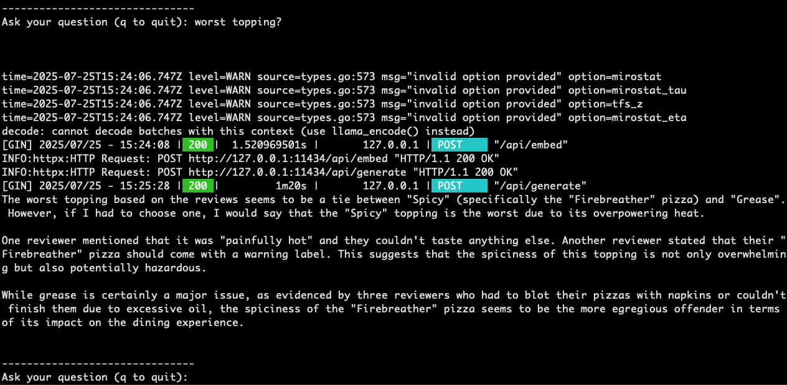

# LLM-Pizza-Reviews

A containerized RAG (Retrieval-Augmented Generation) app that uses a local LLM and vector database to answer questions about pizza restaurant reviews.

The app lets you ask natural language questions like:

```text
What do people think of the cheese pizza?
How is the service?
Is this restaurant good for takeout?
````

It searches through restaurant reviews, finds the most relevant ones, and uses a local LLM to generate an answer based on those reviews.

Tools used:

* **Ollama** to run models like LLaMA 3.2 locally
* **LangChain** to structure prompts and connect the retriever to the LLM
* **Chroma** as a vector database for semantic search
* **Docker** for a portable, reproducible setup

---

## Project Structure

```text
project/
├── app.py               # Main app: prompts user and returns answers
├── vector_store.py      # Loads reviews and builds semantic index
├── config.py            # Ollama base URL, model names, DB path
├── eval.py              # Test questions to validate model answers
├── entrypoint.sh        # Starts Ollama, pulls models, and launches the app
├── Dockerfile           # Defines the container environment
├── requirements.txt     # Python dependencies
├── .dockerignore        # Ignore DB logs and cache files
├── data/
│   └── realistic_restaurant_reviews.csv
├── chrome_langchain_db/ # Vector DB created at runtime
└── rag_log.txt          # Conversation log created at runtime
```

---

## How the app works


### 1. Review Indexing (`vector_store.py`)

`vector_store.py` loads the restaurant review CSV and converts each review into an embedding.

An embedding is a numeric representation of text. Similar text gets similar vectors.

For example:

```text
"Great crust and cheese"
```

gets converted into something like:

```text
[0.12, -0.44, 0.91, ...]
```

These vectors are stored in Chroma so the app can search by meaning, not just exact words.

Example:

```text
Question: "How is the crust?"
```

The app can still find reviews that say:

```text
"The dough was crispy and chewy."
```

even though the word `crust` may not appear exactly.

---

### 2. Interactive Q&A (`app.py`)

`app.py` is the main app.

It does this:

1. Asks the user for a question
2. Uses the retriever to find the top 5 relevant reviews
3. Sends the question and reviews to the LLM
4. Prints the answer
5. Logs the question, retrieved reviews, and answer to `rag_log.txt`

Example:

```text
Ask your question: What do people think of the cheese pizza?
```

The app retrieves related reviews and sends them into a prompt like:

```text
Question:
What do people think of the cheese pizza?

Relevant reviews:
[review 1]
[review 2]
[review 3]
```

Then the model answers using that context.

---

### 3. Evaluation (`eval.py`)

`eval.py` contains simple test questions and expected keywords.

Example:

```python
{
    "question": "What do people think of the cheese pizza?",
    "expected_keywords": ["cheese", "crust"]
}
```

This is useful for quickly checking whether the app still gives reasonable answers after making changes.

---

## Docker Overview

Docker lets this project run in a consistent environment.

Instead of manually installing Python, Ollama, LangChain, Chroma, and models on every computer, the Docker container packages everything together.

In simple terms:

```text
Dockerfile = instructions for building the container
entrypoint.sh = instructions for what to do when the container starts
```

---

## What the Dockerfile does

The `Dockerfile` defines the environment for the app.

At a high level, it:

1. Starts from a Python image
2. Installs system dependencies
3. Installs Ollama
4. Copies the project files into the container
5. Installs Python dependencies from `requirements.txt`
6. Sets `entrypoint.sh` as the startup command

So when you run the container, you do not have to manually start Ollama or run the Python app yourself.

---

## What `entrypoint.sh` does

`entrypoint.sh` runs when the Docker container starts.

It does several things in order:

### 1. Exit if something fails

```bash
set -e
```

This means if any command fails, the script stops immediately.

This is helpful because if Ollama fails to start or a model fails to download, the app should not continue running in a broken state.

---

### 2. Start the Ollama server

```bash
ollama serve &
```

This starts Ollama in the background.

Ollama needs to be running before the Python app can use the local LLM or embedding model.

The `&` means “run this in the background,” so the script can keep going.

---

### 3. Wait until Ollama is ready

```bash
for i in {1..30}; do
    if curl -s http://localhost:11434/api/version > /dev/null 2>&1; then
        echo "✅ Ollama is ready!"
        break
    fi
    echo "   Attempt $i/30..."
    sleep 2
done
```

This checks whether Ollama is actually ready before continuing.

This is important because starting Ollama takes a few seconds.

Without this step, the Python app might start too early and fail because Ollama is not ready yet.

Example problem this avoids:

```text
Python app starts
Python app asks Ollama for embeddings
Ollama is still starting
App crashes
```

The script avoids that by waiting until Ollama responds on:

```text
http://localhost:11434
```

---

### 4. Pull the required models

```bash
ollama pull llama3.2
ollama pull mxbai-embed-large
```

The project uses two models:

```text
llama3.2
```

for answering questions, and:

```text
mxbai-embed-large
```

for creating embeddings.

The embedding model is used by Chroma to search reviews by meaning.

The LLM model is used to generate the final answer.

---

### 5. Start the Python app

```bash
python app.py
```

After Ollama is running and the models are available, the script starts the main app.

At this point, the user can ask questions in the terminal.

---

## Why `entrypoint.sh` is useful

The app depends on Ollama, so the startup order matters.

This would be annoying to do manually every time:

```bash
ollama serve
ollama pull llama3.2
ollama pull mxbai-embed-large
python app.py
```

`entrypoint.sh` automates those steps.

So instead of running several commands, you only run:

```bash
docker run --rm -it pizza-ai
```

The script handles the setup inside the container.

---

## To run the app

### 1. Build the container

```bash
docker build -t pizza-ai .
```

This creates a Docker image called `pizza-ai`.

---

### 2. Run the container interactively

```bash
docker run --rm -it pizza-ai
```

Flags:

```text
--rm
```

removes the container after it exits.

```text
-it
```

lets you type questions into the terminal.

---

## What Happens When You Run It

1. The container starts
2. Docker runs `entrypoint.sh`
3. `entrypoint.sh` starts Ollama
4. The script waits until Ollama is ready
5. The script pulls the required models
6. The script runs `python app.py`
7. The app asks you for a question
8. The retriever finds relevant reviews
9. The LLM generates an answer
10. The result is printed and logged

---

## What is a Vector Database?

Instead of storing data only as rows and columns, a vector database stores the meaning of text as numbers.

Example:

| Review Text                       | Vector               |
| --------------------------------- | -------------------- |
| “Crust was crispy and delicious.” | `[0.11, -0.03, ...]` |

When you ask:

```text
How is the crust?
```

your question is also converted into a vector.

Chroma compares your question vector to the review vectors and returns the most similar reviews.

This is what allows the app to find relevant reviews even when the wording is different.

---

## Example Questions

```text
What do people think of the cheese pizza?
```

```text
How is the service quality?
```

```text
Is the restaurant good for takeout?
```

```text
What pizza should I order?
```

---

## Examples

### Retrieving values from the vector DB



### Running the Docker image



### Example question and answer



---

## Summary

This project combines:

```text
Reviews + Embeddings + Vector Search + Local LLM
```

to create a simple RAG app.

The main idea is:

1. Store reviews in a searchable vector database
2. Retrieve the most relevant reviews for a question
3. Give those reviews to the LLM
4. Generate an answer based on the retrieved context

Docker makes the app easier to run because it packages the environment, starts Ollama, downloads the models, and launches the Python app automatically.
```